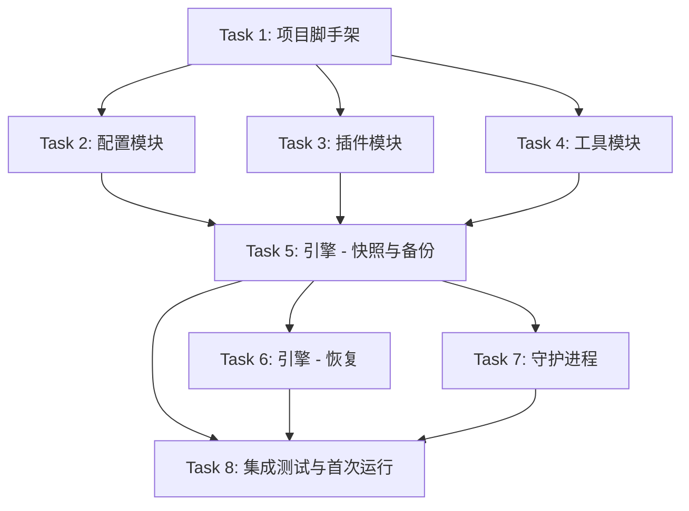

# 架构方案：restore CLI

## 执行元数据

- **Status**：executed
- **Workflow Stage**：plan (code complete)
- **Created**：2026-06-11
- **Updated**：2026-06-11
- **Source Of Truth Until**：plan superseded or project v1.0
- **Requirements Source**：grill session (CSL:grill-me)
- **Compounded Knowledge**：not applicable

## 模块边界

### 模块：cli
- **职责**：commander 入口，定义子命令，分发到各模块
- **输入**：`process.argv`
- **输出**：对应命令的执行结果
- **依赖**：config, plugin, engine, daemon, util
- **不变量**：任何命令都不直接操作文件系统（通过 engine 和 util）

### 模块：config
- **职责**：加载/验证 `~/.config/restore/config.json5`，提供交互式配置向导
- **输入**：文件路径
- **输出**：`Config` 对象
- **依赖**：util（日志）
- **不变量**：默认值始终可用；文件不存在时返回默认配置

### 模块：plugin
- **职责**：管理插件 JSON 文件，提供内置精选列表
- **输入**：插件名称、配置目录路径
- **输出**：解析后的插件列表（包含源路径集）
- **依赖**：util
- **不变量**：插件文件始终是合法的 JSON；内置列表始终可用

### 模块：engine
- **职责**：快照创建/对比/清理/恢复 — 核心备份还原逻辑
- **输入**：源路径、目标配置文件、profile 名
- **输出**：备份快照或还原文件
- **依赖**：config, plugin, util
- **不变量**：快照文件夹永远有 `maxSnapshots` 上限；不改变原始文件

### 模块：daemon
- **职责**：后台进程调度、生命周期管理
- **输入**：配置、间隔时间
- **输出**：按计划执行 `restore backup`
- **依赖**：engine, config
- **不变量**：同一时刻最多一个 daemon 进程；PID 文件用于锁

### 模块：util
- **职责**：日志、文件校验和、文件系统工具（硬链接、复制）
- **输入**：各类参数
- **输出**：纯工具函数
- **依赖**：无
- **不变量**：纯函数，无副作用

## 接口定义

### Config 模块接口

```typescript
// src/config/types.ts
interface Config {
  profiles: Profile[]           // 至少一个 profile
  plugins: string[]             // 启用的插件名列表
  daemon: DaemonConfig
  maxSnapshots: number          // 默认 14
}

interface Profile {
  name: string
  path: string                  // 目标文件夹
  type: 'icloud' | 'local' | 'smb'
  intervalHours?: number        // 覆盖全局默认值
}

interface DaemonConfig {
  intervalHours: number         // 默认 12
}
```

```typescript
// src/config/loader.ts
export function loadConfig(): Config
export function getConfigPath(): string
export function ensureConfigDir(): void
```

```typescript
// src/config/wizard.ts
export async function runWizard(): Promise<void>
```

### Plugin 模块接口

```typescript
// src/plugin/types.ts
interface PluginManifest {
  name: string
  description: string
  paths: string[]               // 要备份的文件/文件夹路径
}
```

```typescript
// src/plugin/registry.ts
export function getBuiltinPlugins(): PluginManifest[]
export function getPluginNames(): string[]
export function getPlugin(name: string): PluginManifest | undefined
export function addPlugin(name: string): Promise<void>
export function installPluginFiles(plugin: PluginManifest): void
```

```typescript
// src/plugin/loader.ts
export function loadPlugins(pluginDir: string): PluginManifest[]
export function loadPlugin(filePath: string): PluginManifest
export function getEnabledPlugins(config: Config): PluginManifest[]
```

### Engine 模块接口

```typescript
// src/engine/snapshot.ts
export async function createSnapshot(sources: string[], dest: string): Promise<string>
  // 返回快照目录名（如 2026-06-11T14.30.00）

// src/engine/diff.ts
export async function diffWithLastSnapshot(sources: string[], destDir: string): Promise<FileDiff[]>

// src/engine/prune.ts
export async function pruneSnapshots(destDir: string, maxCount: number): Promise<void>

// src/engine/restore.ts
export async function restoreFromSnapshot(snapshotDir: string, restoreRoot: string): Promise<void>
export async function listSnapshots(destDir: string): Promise<SnapshotInfo[]>
```

### Daemon 模块接口

```typescript
// src/daemon/scheduler.ts
export function startDaemon(intervalMs: number): void
export function stopDaemon(): void

// src/daemon/lifecycle.ts
export function getPidPath(): string
export function isDaemonRunning(): boolean
export function writePidFile(): void
export function removePidFile(): void
```

### Util 模块接口

```typescript
// src/util/log.ts
export function info(msg: string): void
export function warn(msg: string): void
export function error(msg: string): void
export function debug(msg: string): void
export function setVerbose(v: boolean): void
export function setQuiet(v: boolean): void

// src/util/hash.ts
export function fileHash(filePath: string, algorithm?: string): Promise<string>

// src/util/fs.ts
export function hardlinkCopy(src: string, dest: string): Promise<void>
export function ensureDir(dir: string): Promise<void>
export function copyWithChecksum(src: string, dest: string): Promise<void>
export function listSubdirs(dir: string): Promise<string[]>
```

## JSON Schema

### config.json5

```json5
{
  profiles: [
    {
      name: "icloud",
      path: "~/Library/Mobile Documents/com~apple~CloudDocs/restore",
      type: "icloud",
      intervalHours: 12,
    },
    {
      name: "external",
      path: "/Volumes/Backup/restore",
      type: "local",
    },
  ],
  plugins: ["vscode", "dotfiles"],
  daemon: {
    intervalHours: 12,
  },
  maxSnapshots: 14,
}
```

### 插件 JSON（~/.config/restore/plugins/<name>.json）

```json
{
  "name": "vscode",
  "description": "VS Code settings and extensions",
  "paths": [
    "~/Library/Application Support/Code/User/settings.json",
    "~/Library/Application Support/Code/User/keybindings.json",
    "~/.vscode/extensions"
  ]
}
```

### 内置插件列表

内置在 `src/plugin/registry.ts` 中，提供常用的预定义插件（vscode, dotfiles, ssh, zsh, git 等）。

## 日志规范

日志是 `info(msg)` / `warn(msg)` / `error(msg)` / `debug(msg)` 格式，无结构字段。

- **info**：命令开始/结束、快照创建成功、插件安装成功
- **warn**：文件不可读、快照数接近上限
- **error**：命令失败、文件读写异常
- **debug**：每一个比较的文件、详细步骤
- 所有日志在 `--quiet` 下仅 error
- 所有日志在 `--verbose` 下包含 debug

## RTK 过滤预设

| 命令 | 过滤策略 |
|------|----------|
| `pnpm build` | 仅捕获错误 |
| `pnpm test` | 捕获测试摘要 + 失败详情 |
| `pnpm start -- backup --dry-run` | 仅捕获输出行 |
| `find`, `ls`, `mkdir -p` | 不捕获 |

## 历史经验约束

无历史经验。

## 关键模式检查

无关键模式。

## 简化审计

- Config wizard 默认只问路径和间隔，高级选项单独分支 ✅
- Plugin 采用最小 JSON schema（name + description + paths）✅
- 快照硬链接算法复用标准模式，不自制复杂 diff ✅
- 没有加密，没有实时文件监控，没有网络同步 ✅

## 任务 DAG



## 并行执行计划

| Layer | Parallel Group | Tasks | Execution | Reason |
|-------|---------------|-------|-----------|--------|
| 1 | G1 | Task 1 | serial | 基础脚手架 |
| 2 | G2 | Task 2, Task 3, Task 4 | parallel | 写集不重叠 |
| 3 | G3 | Task 5 | serial | 依赖下层三个模块的产出 |
| 4 | G4 | Task 6, Task 7 | parallel | 写集不重叠，均依赖 Task 5 |
| 5 | G5 | Task 8 | serial | 端到端验证 |

## 任务列表

### 任务 1：项目脚手架
- **Code Status**：done
- **Actual Write Set**：package.json, tsconfig.json, biome.json, .gitignore, src/index.ts, src/types.ts, src/util/log.ts
- **Verification**：`pnpm build` 编译通过, `pnpm start -- --version` 输出 0.1.0
- **Evidence**：dist/index.js, 6 test files pass
- **Layer**：1
- **Parallel Group**：G1
- **Execution**：serial
- **Parallel Blocker**：无
- **Ownership**：项目根目录
- **Read Set**：CLAUDE.md
- **Write Set**：package.json, tsconfig.json, biome.json, .gitignore, src/index.ts, src/types.ts, src/util/log.ts
- **描述**：初始化 Node.js TypeScript 项目，安装依赖（commander, @clack/prompts, json5, zod），配置 tsconfig strict mode，配置 biome，创建基础目录结构 `src/{cli,config,engine,plugin,daemon,util}/`，创建 `src/index.ts` 作为 CLI 入口骨架，创建 `src/util/log.ts` 基础日志工具。
- **成功标准**：`pnpm build` 编译通过，`pnpm start -- --version` 打印版本号
- **预估 Token**：8000
- **依赖**：无
- **涉及文件**：package.json, tsconfig.json, biome.json, .gitignore, src/index.ts, src/types.ts, src/util/log.ts
- **执行指令**：
  1. 创建 package.json，配置 commander 和 @clack/prompts 依赖
  2. 配置 tsconfig.json（strict, ES2022 target, NodeNext module）
  3. 配置 biome.json（合理的默认规则）
  4. 创建 .gitignore（node_modules, dist, *.js, !.ts）
  5. 创建 `src/util/log.ts`：info/warn/error/debug/setVerbose/setQuiet
  6. 创建 `src/types.ts`：共享类型
  7. 创建 `src/index.ts`：commander program 骨架，注册 --version

### 任务 2：配置模块
- **Code Status**：done
- **Actual Write Set**：src/config/types.ts, src/config/loader.ts, src/config/wizard.ts, src/cli/config.ts
- **Verification**：`pnpm build` 编译通过, `npx tsx src/index.ts config` 运行向导
- **Evidence**：wizard 显示 @clack/prompts 交互界面
- **Layer**：2
- **Parallel Group**：G2
- **Execution**：parallel
- **Parallel Blocker**：无
- **Ownership**：src/config/
- **Read Set**：CLAUDE.md
- **Write Set**：src/config/, src/cli/config.ts
- **描述**：实现 config 模块：Config 类型定义、`config.json5` 加载与验证（用 zod 做校验，提供默认值）、`ensureConfigDir()` 确保目录存在。创建 `restore config` 命令（交互式向导，用 @clack/prompts 引导用户配置 profiles、plugins、interval）。
- **成功标准**：`pnpm start -- config` 运行向导并生成合法的 `~/.config/restore/config.json5`
- **预估 Token**：12000
- **依赖**：Task 1
- **涉及文件**：src/config/types.ts, src/config/loader.ts, src/config/wizard.ts, src/cli/config.ts
- **执行指令**：
  1. 定义 Config/Profile/DaemonConfig 类型
  2. 实现 loadConfig：读取 json5 → zod 校验 → 用默认值填充缺失字段
  3. 实现 getConfigPath / ensureConfigDir
  4. 实现 runWizard：分步 @clack/prompts（profile名称 → 路径 → 类型，是否添加更多 profile，选择插件，确认并写入）
  5. 在 src/cli/config.ts 中导入并用 commander 注册为 `restore config`

### 任务 3：插件模块
- **Code Status**：done
- **Actual Write Set**：src/plugin/types.ts, src/plugin/registry.ts, src/plugin/loader.ts, src/cli/plugin.ts
- **Verification**：`npx tsx src/index.ts plugin list` 显示 7 个内置插件
- **Evidence**：plugin list 正确输出 ✅/⬜ 标记
- **Layer**：2
- **Parallel Group**：G2
- **Execution**：parallel
- **Parallel Blocker**：无
- **Ownership**：src/plugin/
- **Read Set**：CLAUDE.md
- **Write Set**：src/plugin/, src/cli/plugin.ts
- **描述**：实现 plugin 模块：PluginManifest 类型、内置插件列表、文件加载/写入。创建 `restore plugin list` 和 `restore plugin add <name>` 命令。
- **成功标准**：`restore plugin list` 显示内置插件；`restore plugin add <name>` 写入对应 JSON 文件到 plugins 目录
- **预估 Token**：10000
- **依赖**：Task 1
- **涉及文件**：src/plugin/types.ts, src/plugin/registry.ts, src/plugin/loader.ts, src/cli/plugin.ts
- **执行指令**：
  1. 定义 PluginManifest 类型
  2. 实现 registry.ts：内置插件列表（vscode, dotfiles, ssh, zsh, git, iterm2, vim）
  3. 实现 loader.ts：从 plugins 目录加载并校验 JSON 文件
  4. 实现 registry.ts 中的 addPlugin：从精选列表复制到 plugins 目录
  5. 在 src/cli/plugin.ts 中用 commander 注册 `restore plugin list|add`

### 任务 4：工具模块
- **Code Status**：done
- **Actual Write Set**：src/util/hash.ts, src/util/fs.ts, src/util/hash.test.ts, src/util/fs.test.ts
- **Verification**：`pnpm test` 6 个 util 单元测试通过
- **Evidence**：hash + fs 测试 230ms 内全部通过
- **Layer**：2
- **Parallel Group**：G2
- **Execution**：parallel
- **Parallel Blocker**：无
- **Ownership**：src/util/
- **Read Set**：CLAUDE.md
- **Write Set**：src/util/（除 log.ts 外）
- **描述**：实现文件系统工具函数：`fileHash()`（SHA256）、`hardlinkCopy()`（`fs.link` fallback 到 copy）、`ensureDir()`、`copyWithChecksum()`（复制后验证 hash）、`listSubdirs()`。
- **成功标准**：单元测试通过（vitest）
- **预估 Token**：8000
- **依赖**：Task 1
- **涉及文件**：src/util/hash.ts, src/util/fs.ts
- **执行指令**：
  1. 实现 hash.ts：`fileHash(path)` 用 `crypto.createHash('sha256')`
  2. 实现 fs.ts：`hardlinkCopy`, `ensureDir`, `copyWithChecksum`, `listSubdirs`
  3. 创建 src/util/hash.test.ts 和 src/util/fs.test.ts

### 任务 5：引擎 — 快照与备份
- **Code Status**：done
- **Actual Write Set**：src/engine/snapshot.ts, src/engine/diff.ts, src/engine/prune.ts, src/cli/backup.ts
- **Verification**：`npx tsx src/index.ts backup --dry-run` 输出, 集成测试验证快照硬链接
- **Evidence**：第二快照显示 "2 linked, 0 copied"
- **Layer**：3
- **Parallel Group**：G3
- **Execution**：serial
- **Parallel Blocker**：依赖 Task 2, 3, 4 的产出
- **Ownership**：src/engine/snapshot.ts, src/engine/diff.ts, src/engine/prune.ts, src/cli/backup.ts
- **Read Set**：CLAUDE.md, src/config/types.ts, src/plugin/types.ts
- **Write Set**：src/engine/snapshot.ts, src/engine/diff.ts, src/engine/prune.ts, src/cli/backup.ts
- **描述**：实现快照引擎。核心逻辑：
  - `createSnapshot(sources, destDir)`：检查源文件相对于上次快照的变化 → 对新文件做 hardlink copy，修改的文件做普通 copy。快照目录以 ISO 时间戳命名。在目标文件夹根目录维护一个 `.snapshots` 索引文件记录快照列表。
  - `diffWithLastSnapshot(sources, destDir)`：对比当前文件与最新快照，返回变化列表。
  - `pruneSnapshots(destDir, maxCount)`：排序快照列表，删除超过 maxCount 的最旧快照。
- 创建 `restore backup` 命令：读取 config → 合并插件路径 → 遍历 profiles → 创建快照 → 清理。
- **成功标准**：`restore backup --dry-run` 输出将要备份的文件列表
- **预估 Token**：16000
- **依赖**：Task 2, Task 3, Task 4
- **涉及文件**：src/engine/snapshot.ts, src/engine/diff.ts, src/engine/prune.ts, src/cli/backup.ts
- **执行指令**：
  1. 实现 diff.ts：对比源文件与最新快照文件的 mtime + size，递归扫描源目录。硬链接文件不会增加存储消耗。
  2. 实现 snapshot.ts：创建 ISO 时间戳目录，对未变更文件用 `hardlinkCopy`（指向最新快照中的文件），变更/新增的用 `copyWithChecksum`。
  3. 实现 prune.ts：读取快照列表，按时间排序，删除最旧的超出 maxCount 的快照。
  4. 在 src/cli/backup.ts 中实现 `restore backup --profile <name> --dry-run`

### 任务 6：引擎 — 恢复
- **Code Status**：done
- **Actual Write Set**：src/engine/restore.ts, src/cli/restore.ts
- **Verification**：`npx tsx src/index.ts restore --list`, 集成测试 restoreFromSnapshot
- **Evidence**：集成测试验证文件恢复成功
- **Layer**：4
- **Parallel Group**：G4
- **Execution**：parallel
- **Parallel Blocker**：无（与 Task 7 写集不重叠）
- **Ownership**：src/engine/restore.ts, src/cli/restore.ts
- **Read Set**：CLAUDE.md, src/config/types.ts
- **Write Set**：src/engine/restore.ts, src/cli/restore.ts
- **描述**：实现 `restoreFromSnapshot(snapshotDir, restoreRoot)`：从指定快照复制所有文件到目标路径。实现 `listSnapshots(destDir)`：列出所有快照及时间信息。创建 `restore restore` 命令：列出可用快照 → 用户选择 → 确认 → 恢复。支持 --snapshot 参数直接指定。
- **成功标准**：`restore restore --snapshot <dir>` 将快照内文件恢复到源位置
- **预估 Token**：10000
- **依赖**：Task 5
- **涉及文件**：src/engine/restore.ts, src/cli/restore.ts
- **执行指令**：
  1. 实现 listSnapshots：扫描 destDir 下按时间排序的快照目录
  2. 实现 restoreFromSnapshot：遍历快照目录，复制文件到 restoreRoot
  3. 在 src/cli/restore.ts 中实现 `restore restore --snapshot <id>`，如未提供则用 @clack/prompts 让用户选择

### 任务 7：守护进程
- **Code Status**：done
- **Actual Write Set**：src/daemon/lifecycle.ts, src/daemon/scheduler.ts, src/daemon/worker.ts, src/cli/daemon.ts
- **Verification**：`npx tsx src/index.ts daemon status` 输出 "Daemon is not running"
- **Evidence**：daemon --help 显示 start/stop/status
- **Layer**：4
- **Parallel Group**：G4
- **Execution**：parallel
- **Parallel Blocker**：无（与 Task 6 写集不重叠）
- **Ownership**：src/daemon/, src/cli/daemon.ts
- **Read Set**：CLAUDE.md
- **Write Set**：src/daemon/, src/cli/daemon.ts
- **描述**：实现后台 daemon。`startDaemon(intervalMs)`：用 `setInterval` 每 intervalMs 执行一次 `restore backup`。`stopDaemon()`：向 PID 文件进程发 SIGTERM。使用 `process.on('SIGTERM', ...)` 清理退出。
  - PID 文件存放在 `~/.config/restore/restore.pid`
  - `startDaemon` fork 子进程、写 PID 文件、detach
  - `stopDaemon` 读 PID、发 SIGTERM、删 PID 文件
  - `isDaemonRunning` 检查 PID 文件 + 进程存在
- **成功标准**：`restore daemon start && sleep 2 && restore daemon stop` 成功启动并停止
- **预估 Token**：12000
- **依赖**：Task 5
- **涉及文件**：src/daemon/scheduler.ts, src/daemon/lifecycle.ts, src/cli/daemon.ts
- **执行指令**：
  1. 实现 lifecycle.ts：getPidPath, writePidFile, removePidFile, isDaemonRunning
  2. 实现 scheduler.ts：startDaemon（子进程 fork，setInterval 执行 backup），stopDaemon（SIGTERM）
  3. 在 src/cli/daemon.ts 中注册 `restore daemon start|stop`

### 任务 8：集成测试与首次运行
- **Code Status**：done
- **Actual Write Set**：tests/integration/, src/index.ts (首次运行逻辑)
- **Verification**：`pnpm test` 14 个测试全部通过
- **Evidence**：无 config 时自动启动向导
- **Layer**：5
- **Parallel Group**：G5
- **Execution**：serial
- **Parallel Blocker**：依赖所有前置任务
- **Ownership**：集成测试、cli/index.ts 首次运行逻辑
- **Read Set**：全部源文件
- **Write Set**：tests/, src/index.ts（首次运行检测）
- **描述**：
  1. 在 src/index.ts 中增加首次运行检测：如果 config 文件不存在且无 --help/--version 参数，自动调用 config wizard
  2. 编写端到端测试：创建临时配置 → 运行 backup → 验证快照目录 → 运行 restore → 验证文件恢复
  3. 测试循环依赖：所有 `import` 可解析
  4. 测试 CLI 帮助输出：每个子命令都有 --help
- **成功标准**：`pnpm test` 全部通过，首次运行自动弹出向导
- **预估 Token**：12000
- **依赖**：Task 5, Task 6, Task 7
- **涉及文件**：src/index.ts, 测试文件
- **执行指令**：
  1. 修改 src/index.ts：在 program.parseAsync() 前检查 config 是否存在，若不存在则运行 wizard
  2. 创建 tests/e2e/backup-restore.test.ts：用 tempdir 模拟完整流程
  3. 创建 tests/e2e/plugin.test.ts：测试 plugin add/list
  4. 创建 tests/e2e/config.test.ts：测试首次运行向导启动

## 会话拆分点
- 拆分点 1：Task 1 + Task 2 + Task 3 + Task 4 完成后（~38000 Token）
- 拆分点 2：Task 5 完成后（~16000 Token）
- 拆分点 3：Task 6 + Task 7 完成后（~22000 Token）

建议每个 Layer 完成后做一次编译验证 + git commit。

## 通过条件

Plan must pass:
- [x] 所有模块是 hermetic 和 idempotent 的
- [x] Simplicity First 检查通过
- [x] 日志规范确定且完整
- [x] 无依赖穿透
- [x] 所有任务有可验证的成功标准
- [x] DAG 无循环依赖
- [x] 会话拆分在合理边界
- [x] 指令明确且有界
- [x] 每个任务有显式的 Ownership、Read Set、Write Set
- [x] Write Set 是 Ownership 的子集
- [x] Parallel group 内 Write Set 无重叠
- [x] 执行元数据已存在且 Status = executed
- [x] AGENTS.md 已创建

## Code Execution Summary

| Task | Status | Files | Verification |
|------|--------|-------|-------------|
| 1. 项目脚手架 | ✅ done | package.json, tsconfig, biome, .gitignore, src/index.ts, src/types.ts, src/util/log.ts | `pnpm build` + version |
| 2. 配置模块 | ✅ done | src/config/, src/cli/config.ts | wizard @clack/prompts |
| 3. 插件模块 | ✅ done | src/plugin/, src/cli/plugin.ts | `plugin list` 7 plugins |
| 4. 工具模块 | ✅ done | src/util/hash.ts, fs.ts + tests | 6 unit tests pass |
| 5. 引擎-快照 | ✅ done | src/engine/snapshot.ts, diff.ts, prune.ts, src/cli/backup.ts | hardlinks "2 linked, 0 copied" |
| 6. 引擎-恢复 | ✅ done | src/engine/restore.ts, src/cli/restore.ts | restore --list + integration test |
| 7. 守护进程 | ✅ done | src/daemon/, src/cli/daemon.ts | `daemon status` not running |
| 8. 集成测试 | ✅ done | tests/integration/, src/index.ts 首次运行 | 14/14 tests pass |

**Bugs Fixed During Code:**
1. ✅ @clack/prompts v0.7 类型兼容 — select/multiselect/confirm 类型参数修复
2. ✅ Snapshot 目录创建时机错误 — `ensureDir` 在 `getLatestSnapshotDir` 之后
3. ✅ mtime 精度丢失 — `Math.round()` 比较毫秒级 mtime
4. ✅ 时间戳碰撞 — 添加毫秒精度
5. ✅ Prune 排序 — 按 birthtime 而非字母序
6. ✅ restore walk — 使用递归 walk 替代 Node 20.1+ 的 recursive readdir
