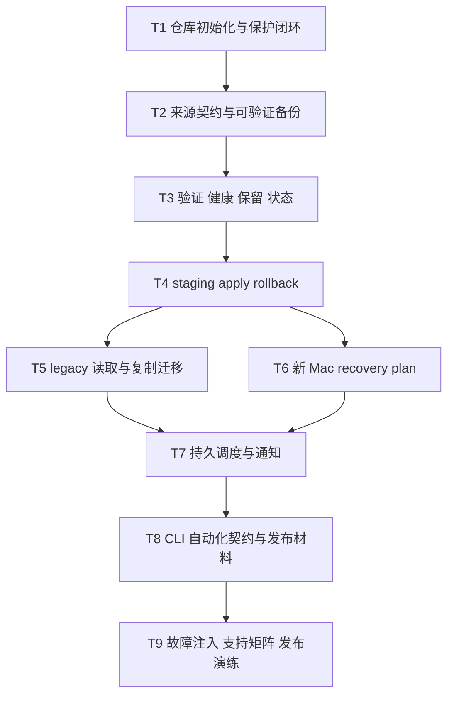

# 架构方案：restore-cli 1.0.0 可信恢复

## 执行元数据

- **Status**：active
- **Workflow Stage**：plan
- **Created**：2026-07-18
- **Updated**：2026-07-18
- **Source Of Truth Until**：全部任务执行并通过 review，或本计划被显式 superseded
- **Requirements Source**：[`docs/anvil/brainstorms/2026-07-18-restore-cli-1.0-mrd.md`](../brainstorms/2026-07-18-restore-cli-1.0-mrd.md)（Status: confirmed）
- **Compounded Knowledge**：not yet compounded

## 架构结论

1.0 使用一个简单的、版本化的文件仓库，不把现有时间戳目录继续扩展成隐式协议。配置数据规模小，因此不引入分块、压缩、内容寻址或远端 provider 抽象。

核心数据流：

```text
JSON plugin/source contract
  → capture catalog + metadata
  → repository target preflight + exclusive lock
  → optional authenticated encryption
  → pending recovery point
  → manifest/content verification
  → atomic publish
  → structural/full verify
  → staging restore + verify
  → safety point + explicit apply
```

仓库根目录：

```text
RestoreBackup/
├── repository.json               # 非敏感仓库身份、格式版本、保护模式
├── keys/
│   └── recovery.json             # 加密仓库的 wrapped master key
├── points/
│   ├── <point-id>.pending/        # 不可列为恢复点
│   └── <point-id>/
│       ├── point.json             # 最小公开状态/时间/版本
│       ├── manifest.json|enc      # 完整来源、路径、metadata、blob 映射
│       └── blobs/<opaque-id>      # 原始或逐 blob 认证加密内容
├── locks/
└── operations/                   # 有限、可轮转的最终结果
```

加密仓库使用 Node `crypto` 的标准认证加密；随机 master key 保存在 macOS Keychain，独立 recovery secret 用于包装/解包 master key。具体参数必须集中在 protection 模块并带版本，不能散落在业务代码。

## 模块边界

### 模块：repository

- **职责**：仓库身份、格式布局、目标能力、空间、锁、point 生命周期和操作记录。
- **输入**：仓库路径、预期 ID、operation、只读/读写模式。
- **输出**：已验证的 repository handle、lock handle、point descriptors、operation result。
- **依赖**：Node fs/path/os/crypto（仅随机 ID/hash）、util。
- **不变量**：路径不是身份；写操作必须 preflight + lock；pending 永不对 list 可见；不自动修复。

### 模块：protection

- **职责**：master key、Keychain、recovery secret、blob/manifest 认证加密与明文模式标记。
- **输入**：repository identity、protection descriptor、secret source。
- **输出**：seal/open 能力与安全的 credential lifecycle 结果。
- **依赖**：Node crypto、macOS `security` CLI。
- **不变量**：secret 不进入 argv/log/JSON；认证失败先于业务写入；算法/格式显式版本化。

### 模块：catalog

- **职责**：内置/用户插件、source contract、路径规范化、required/optional/sensitivity、entry/metadata capture。
- **输入**：config、plugin JSON、支持矩阵、源文件系统。
- **输出**：确定的 capture plan 和 entry catalog。
- **依赖**：config、plugin、Node fs、受控 macOS metadata 命令。
- **不变量**：隐藏项不丢失；symlink 不越界跟随；未声明 sensitivity 从严；每个 skip 有分类。

### 模块：backup

- **职责**：prepare、capture、pending 写入、验证、publish 和 backup result。
- **输入**：repository handle、capture plan、progress sink。
- **输出**：healthy recovery point 或稳定的 warning/partial/failure。
- **依赖**：repository、protection、catalog、verify。
- **不变量**：required 失败不发布；相同 ID 不合并；中断不暴露恢复点。

### 模块：verify

- **职责**：structural/content 验证、health 计算、retention 选择和只读诊断。
- **输入**：repository handle、point selection、coverage scope。
- **输出**：coverage 明确的 verification/retention report。
- **依赖**：repository、protection。
- **不变量**：verify 默认零写入；结构检查不得冒充内容检查；最后 healthy 不删除。

### 模块：recovery

- **职责**：point browse、staging、staging verify、apply、Safety Point、rollback。
- **输入**：固定 point ID、范围、staging/apply target、conflict policy。
- **输出**：可重试 recovery/apply/rollback result。
- **依赖**：repository、protection、catalog metadata codec、verify。
- **不变量**：默认不写原路径；逐文件原子；无隐式 delete；中断不返回成功。

### 模块：migration

- **职责**：0.1.x legacy discovery/read/restore 和只读 copy migration。
- **输入**：legacy root、v1 repository handle、selected snapshots。
- **输出**：legacy descriptor、migration report、验证后的 v1 points。
- **依赖**：现有 legacy engine、repository、backup/verify、recovery。
- **不变量**：源永不修改/删除；目标 pending 不完整时不可见；迁移后逐 point 验证。

### 模块：recovery-plan

- **职责**：新 Mac 差异、缺失软件清单和显式声明式安装阶段。
- **输入**：point inventories、当前机器 inventory、opt-in install selection。
- **输出**：默认只读 plan 或逐项安装结果。
- **依赖**：plugin inventory、受控外部 CLI runner。
- **不变量**：默认不安装；daemon 不可调用；DMG/App Store/未知来源永远 manual。

### 模块：scheduler

- **职责**：macOS 持久调度、互斥 backup 触发、operation history、degraded 和本地通知。
- **输入**：config、launchd lifecycle、backup final result。
- **输出**：持久 schedule/status/notification。
- **依赖**：backup CLI、repository status、macOS launchd/notification。
- **不变量**：不触发 apply/migration/install；目标缺失不创建替代路径；24h 过期 degraded。

### 模块：cli

- **职责**：commander 参数、交互确认、stdout/stderr、JSON final result、稳定退出分类。
- **输入**：argv、TTY/non-interactive、service results。
- **输出**：人类或机器可消费的结果与 exit code。
- **依赖**：所有 service 模块，但不直接实现文件仓库行为。
- **不变量**：危险动作 dry-run；non-interactive 不自动确认；机器输出不混 prompt/TTY。

## 接口定义

```typescript
type ProtectionMode = 'encrypted' | 'plaintext'
type SourceRequirement = 'required' | 'optional'
type Sensitivity = 'public' | 'private' | 'secret'
type OperationState = 'success' | 'warning' | 'partial' | 'degraded' | 'failure'
type VerificationScope = 'structural' | 'content'

interface RepositoryDescriptor {
  formatVersion: 1
  repositoryId: string
  createdAt: string
  protection: ProtectionMode
  targetIdentity: TargetIdentity
}

interface SourceSpec {
  id: string
  path: string
  requirement: SourceRequirement
  sensitivity: Sensitivity
  expectedType?: 'file' | 'directory' | 'symlink' | 'any'
}

interface RecoveryPointManifest {
  formatVersion: 1
  pointId: string
  startedAt: string
  completedAt: string
  sourceHost: SourceHost
  cliVersion: string
  protection: ProtectionMode
  sources: CapturedSource[]
  entries: CapturedEntry[]
  warnings: ClassifiedIssue[]
}

interface OperationResult {
  operation: string
  state: OperationState
  startedAt: string
  endedAt: string
  repositoryId?: string
  pointId?: string
  counts: OperationCounts
  issues: ClassifiedIssue[]
}
```

窄接口：

```typescript
openRepository(path, intent): Promise<RepositoryHandle>
initializeRepository(options): Promise<RepositoryInitResult>
acquireRepositoryLock(repo, operation): Promise<RepositoryLock>
buildCapturePlan(config): Promise<CapturePlan>
createRecoveryPoint(repo, plan, options): Promise<OperationResult>
verifyRepository(repo, selection, scope): Promise<VerificationResult>
stageRecovery(repo, pointId, selection, target): Promise<RecoveryResult>
applyStaging(staging, policy): Promise<ApplyResult>
rollbackSafetyPoint(safetyId, options): Promise<ApplyResult>
migrateLegacy(source, target, options): Promise<MigrationResult>
```

## 状态与错误契约

稳定错误类别：

| Category | 语义 | 默认 exit |
| --- | --- | --- |
| success | 完整成功 | 0 |
| warning | 目标完成但有非保真/optional warning | 2 |
| partial | 只完成部分选择；不能当 healthy | 3 |
| configuration | config/plugin/source contract 无效 | 10 |
| authentication | credential/认证失败 | 11 |
| lock | 仓库忙或 stale lock 未处理 | 12 |
| source | required source 读取/一致性失败 | 13 |
| destination | 目标缺失、身份、空间、能力失败 | 14 |
| integrity | 结构/内容验证失败 | 15 |
| unsupported | OS/CPU/format/metadata 不支持 | 16 |
| cancelled | 用户取消，无 mutation | 17 |
| internal | 未分类内部错误 | 20 |

## 日志规范

最终机器结果字段固定：

```text
operation, state, category, repositoryId, pointId,
startedAt, endedAt, filesConsidered, filesWritten,
filesSkipped, filesFailed, bytesRead, bytesWritten,
verificationScope, issues[]
```

- stdout：成功摘要或单个 JSON final result。
- stderr：进度、warning、error 和 prompt。
- 不记录：master/recovery key、Keychain value、文件内容、完整 secret path。
- 长操作 progress 与 final result 分离。
- operation history 只保存最终结构化结果，有限轮转。

## RTK 过滤预设

| 命令 | 策略 |
| --- | --- |
| `rtk pnpm typecheck` | 只显示 TypeScript 错误 |
| `rtk pnpm lint` | 只显示违规和摘要 |
| `rtk pnpm build` | 只显示构建错误 |
| `rtk pnpm test` | 显示 pass/fail 摘要与失败详情 |
| `rtk git diff --stat` | 先看范围，再定点 diff |
| 故障注入测试 | 单文件/单场景执行，失败后再扩大输出 |

## Knowledge Probe

- **Policy Source**：项目 `AGENTS.md`、Anvil `/anvil:plan` 与 `rules/lightweight.md`。
- **Actual Invocation**：2026-07-18 检查 `docs/anvil/knowledge/`，并准备按 `backup|restore|repository|encryption|snapshot|migration|keychain|integrity` 检索。
- **Ordered Candidate Ranking**：0；knowledge directory 不存在。
- **Active Matches**：0。
- **Draft Clues**：0。
- **Relevant Conflicts**：0。
- **Unrelated Conflicts**：0。
- **Decision**：`continue`；confirmed MRD、当前代码和测试为事实源。

## 历史经验约束

无 active Anvil knowledge。背景研究约束已由 confirmed MRD 吸收，不作为独立规范源。

## 关键模式检查

无 `priority: critical` knowledge 页面。实现必须满足 MRD 的 fault-injection、secret、legacy read-only 和 recovery drill 门禁。

## 简化审计

- 删除通用远端 storage interface：1.0 只支持已挂载 filesystem capability contract。
- 删除分块、压缩和跨 point dedup：配置数据小，14 个恢复点可接受。
- 删除 repair/salvage framework：只实现只读 diagnose/verify。
- 删除通用 workflow engine：recovery 使用固定阶段和窄 service 调用。
- 删除任意代码 plugin：用户插件保持 JSON 声明式。
- 删除通用 installer：仅显式 allowlist 的声明式 runner。
- 使用 Node stdlib crypto 和 macOS 原生 Keychain/launchd，不新增安全/调度框架。
- 50% 删除测试结论：以上删除后仍完整覆盖 confirmed MRD；继续删除 repository identity、auth encryption、verify、staging/apply、legacy reader 或 persistent schedule 会破坏 P0。

## 任务 DAG



## 并行执行计划

| Layer | Parallel Group | Tasks | Execution | Reason |
| --- | --- | --- | --- | --- |
| 1 | G1 | T1 | serial | 建立共享仓库/安全接口 |
| 2 | G2 | T2 | serial | 修改共享 plugin/config/capture contract |
| 3 | G3 | T3 | serial | 依赖 point/manifest 并建立 health contract |
| 4 | G4 | T4 | serial | 恢复状态机依赖前述所有共享接口 |
| 5 | G5 | T5 | serial | legacy migration 写入 v1 point |
| 5 | G6 | T6 | serial | recovery plan 共享 recovery/CLI contract，避免并发冲突 |
| 6 | G7 | T7 | serial | scheduler 依赖最终 backup/status contract |
| 7 | G8 | T8 | serial | 统一修改 CLI root、config、package/docs |
| 8 | G9 | T9 | serial | final hardening 可修改任一缺陷文件 |

并行全部关闭：共享 schema、repository interfaces、CLI root 和全局测试基础设施贯穿多个任务；强行并发会提高合并和安全审查成本。

## 任务列表

### T1：仓库初始化与保护闭环

- **Layer**：1
- **Parallel Group**：G1
- **Execution**：serial
- **Parallel Blocker**：定义所有下游共享 repository/protection contracts
- **Ownership**：`src/repository/**`、`src/protection/**`、`src/cli/repository.ts`、`tests/repository/**`
- **Read Set**：`src/util/**`、`src/config/**`、MRD、research note
- **Write Set**：`src/repository/**`、`src/protection/**`、`src/cli/repository.ts`、`tests/repository/**`
- **描述**：实现 v1 descriptor/layout、target init/preflight/identity/statfs、无 ABA 的跨进程锁、严格 operation result、plaintext/encrypted repository、Node 认证加密、Keychain adapter、经读回验证与 durable publish 的 recovery secret export/import，以及不重写历史 blob 的凭据轮换/日常 Keychain 凭据撤销。
- **成功标准**：测试证明错误 target identity、只读/空间、并发锁/损坏锁、错误 key、未认证写入、认证篡改、symlink recovery export 和非普通/超大元数据读取均在目标业务写入前失败；encrypted blob/manifest round-trip 通过；导出的 recovery artifact 被实际读回验证；新 recovery credential 生效且当前 wrapper 不再接受旧 credential；secret 不出现在 argv、错误、结果或 operation JSON。
- **验证**：`pnpm test tests/repository`；`pnpm typecheck`；定点 Biome。
- **预估 Token**：90k
- **依赖**：无
- **涉及文件**：Ownership 全部。
- **执行指令**：先定义最小 interfaces 和 test vectors，再接 macOS `security` adapter；测试使用内存/临时 credential provider，不访问真实用户 Keychain。写 handle 必须通过保护模式对应的认证门禁；恢复凭据/descriptor/key material 的发布使用 bounded no-follow I/O、文件与目录同步及 descriptor-last 顺序。轮换只撤销“当前 repository wrapper + credential”组合；已被复制的旧 wrapper 与旧 credential 无法被事后召回，必须在文档中明确该密码学边界。

### T2：来源契约与可验证备份

- **Layer**：2
- **Parallel Group**：G2
- **Execution**：serial
- **Parallel Blocker**：修改 config/plugin 共享 schema 与 backup contract
- **Ownership**：`src/catalog/**`、`src/plugin/**`、`src/config/**`、`src/engine/v1-backup.ts`、`src/cli/backup.ts`、相关测试
- **Read Set**：T1 interfaces、现有 diff/snapshot/run-backup、内置 inventory
- **Write Set**：`src/catalog/**`、`src/plugin/**`、`src/config/**`、`src/engine/v1-backup.ts`、`src/cli/backup.ts`、相关测试
- **描述**：扩展 declarative source required/optional/sensitivity/type；加载用户 JSON plugin；安全遍历隐藏项/symlink；capture metadata/content；pending point 写入、required gate、验证和 publish；保留 legacy backup reader 但新写仅 v1。
- **成功标准**：隐藏目录、symlink escape、required failure、optional warning、中途变化、pending interruption、duplicate point 均有测试；失败不产生 visible point。
- **验证**：catalog/backup 单元与集成测试、`pnpm typecheck`、lint、build。
- **预估 Token**：110k
- **依赖**：T1
- **涉及文件**：Ownership 全部。
- **执行指令**：避免通用 VFS；针对 macOS 用户空间 metadata 建窄 codec；旧 `paths` 自动映射为 optional/private 兼容输入。

### T3：验证、健康、保留与状态

- **Layer**：3
- **Parallel Group**：G3
- **Execution**：serial
- **Parallel Blocker**：建立所有下游依赖的 health/selection contract
- **Ownership**：`src/verify/**`、`src/engine/v1-retention.ts`、`src/engine/v1-stat.ts`、`src/cli/verify.ts`、`src/cli/status.ts`、相关测试
- **Read Set**：T1/T2 repository/manifest、现有 prune/stat
- **Write Set**：`src/verify/**`、`src/engine/v1-retention.ts`、`src/engine/v1-stat.ts`、`src/cli/verify.ts`、`src/cli/status.ts`、相关测试
- **描述**：实现 structural/content scopes、healthy/latest healthy、content coverage、只读诊断、14 healthy retention dry-run/execute、Safety Point protection hooks、degraded/status/history。
- **成功标准**：损坏 manifest、缺失 blob、篡改 blob、错误认证分别被正确 scope 发现；partial 不成为 latest healthy；最后 healthy 不删除；dry-run 选择等于 execute。
- **验证**：verify/retention/status 测试、typecheck/lint/build。
- **预估 Token**：75k
- **依赖**：T2
- **涉及文件**：Ownership 全部。
- **执行指令**：不实现 repair；verification report 必须带 scope/coverage。

### T4：staging、apply 与 rollback

- **Layer**：4
- **Parallel Group**：G4
- **Execution**：serial
- **Parallel Blocker**：共享 metadata codec、health selection 和 CLI recovery contract
- **Ownership**：`src/recovery/**`、`src/cli/restore.ts`、`src/cli/apply.ts`、恢复相关测试
- **Read Set**：T1-T3、现有 restore/path helpers
- **Write Set**：`src/recovery/**`、`src/cli/restore.ts`、`src/cli/apply.ts`、恢复相关测试
- **描述**：point browse/selection、default staging、逐文件认证读取和原子发布、metadata restore/verify、conflict plan、Safety Point、explicit apply、retry 与 rollback。
- **成功标准**：默认不写原路径；大文件/metadata/apply 中断无截断成功；无 implicit delete；Safety Point 可 rollback；结果分类完整。
- **验证**：recovery fault tests、现有 backup-restore integration、typecheck/lint/build。
- **预估 Token**：110k
- **依赖**：T3
- **涉及文件**：Ownership 全部。
- **执行指令**：whole-tree atomic 不做；保证逐文件原子和精确 partial report。

### T5：legacy 读取与复制迁移

- **Layer**：5
- **Parallel Group**：G5
- **Execution**：serial
- **Parallel Blocker**：写入 v1 repository 并共享 restore CLI selection
- **Ownership**：`src/migration/**`、`src/cli/migrate.ts`、legacy/migration 测试
- **Read Set**：现有 snapshot/restore、T1-T4
- **Write Set**：`src/migration/**`、`src/cli/migrate.ts`、legacy/migration 测试
- **描述**：legacy detect/list/restore descriptor、copy migration dry-run/space/preflight、逐 point import/verify、中断重试、源只读证明。
- **成功标准**：0.1.x fixture 可 list/restore；迁移前后源 hash 不变；中断目标无坏 visible point；迁移点 content verify 通过。
- **验证**：migration integration、typecheck/lint/build。
- **预估 Token**：55k
- **依赖**：T4
- **涉及文件**：Ownership 全部。
- **执行指令**：不提供源 delete；迁移只通过 public v1 point writer。

### T6：新 Mac recovery plan 与显式安装

- **Layer**：5
- **Parallel Group**：G6
- **Execution**：serial
- **Parallel Blocker**：共享 CLI/operation result 与 inventory code
- **Ownership**：`src/recovery-plan/**`、`src/cli/recover.ts`、inventory runner 相关文件和测试
- **Read Set**：T4、内置 Homebrew/VS Code/Raycast/mac-app inventory
- **Write Set**：`src/recovery-plan/**`、`src/cli/recover.ts`、inventory runner 相关文件和测试
- **描述**：空白 profile recovery plan、当前/point inventory diff、默认 missing report、显式 allowlisted installer dry-run/execute/resume；manual-only 分类。
- **成功标准**：默认零安装；daemon 不可触发；显式 install 只执行 allowlist；DMG/App Store/未知项 manual；中断可从 failed/pending 继续。
- **验证**：recovery-plan 单元/集成、shell syntax、typecheck/lint/build。
- **预估 Token**：50k
- **依赖**：T4
- **涉及文件**：Ownership 全部。
- **执行指令**：不创建 installer framework；允许列表从现有 inventory 显式映射。

### T7：持久调度、历史与通知

- **Layer**：6
- **Parallel Group**：G7
- **Execution**：serial
- **Parallel Blocker**：依赖最终 backup/status/exit contract
- **Ownership**：`src/daemon/**`、`src/scheduler/**`、`src/cli/daemon.ts`、scheduler 测试
- **Read Set**：T2/T3/T6、现有 daemon
- **Write Set**：`src/daemon/**`、`src/scheduler/**`、`src/cli/daemon.ts`、scheduler 测试
- **描述**：用 launchd 持久计划替代不持久 detached worker；12h default/0 disabled；重启恢复；repository lock；24h degraded；有限 history；macOS notification adapter。
- **成功标准**：plist 生成确定；start/stop/status 幂等；scheduler 只触发 backup；目标缺失不建目录；degraded/notification 测试通过。
- **验证**：scheduler unit/integration（mock launchctl）、现有 daemon tests、typecheck/lint/build。
- **预估 Token**：50k
- **依赖**：T5、T6
- **涉及文件**：Ownership 全部。
- **执行指令**：测试不得修改真实用户 LaunchAgents/launchd；adapter 注入 command runner。

### T8：CLI 自动化契约、平台门禁与发布材料

- **Layer**：7
- **Parallel Group**：G8
- **Execution**：serial
- **Parallel Blocker**：统一修改 root CLI、package、config 和全局 docs/tests
- **Ownership**：`src/cli/**`、`src/index.ts`、`src/util/result.ts`、`package.json`、`README.md`、`docs/recovery/**`、CLI integration tests
- **Read Set**：T1-T7 commands/results、AGENTS/SOP
- **Write Set**：`src/cli/**`、`src/index.ts`、`src/util/result.ts`、`package.json`、`README.md`、`docs/recovery/**`、CLI integration tests
- **描述**：注册 repository/verify/restore/apply/migrate/recover；统一 `--json`、non-interactive、exit categories、stdout/stderr；Apple Silicon/current+2 gate；offline checklist；clean dist packaging。
- **成功标准**：所有核心命令 human/JSON contract 通过；Intel 明确 unsupported；non-interactive 风险失败；npm pack 无 stale 文件；recovery checklist 完整。
- **验证**：CLI integration、typecheck/lint/build/test、`npm pack --dry-run --json`。
- **预估 Token**：70k
- **依赖**：T7
- **涉及文件**：Ownership 全部。
- **执行指令**：不新增 telemetry/GUI；成功 stdout，进度/错误 stderr。

### T9：故障注入、支持矩阵与发布演练

- **Layer**：8
- **Parallel Group**：G9
- **Execution**：serial
- **Parallel Blocker**：final hardening 可回写任一 P0 缺陷文件
- **Ownership**：全仓库（仅修复 release gate 发现的缺陷）、`tests/fault/**`、`tests/e2e/**`、MRD/plan status
- **Read Set**：全仓库、confirmed MRD、所有 prior results
- **Write Set**：全仓库（仅 P0 gate 修复）、`tests/fault/**`、`tests/e2e/**`、MRD/plan status
- **描述**：覆盖 MRD 17 项硬门禁；backup/restore interruption、corruption、space/readonly/network/lock/auth/source faults；clean-profile drill harness；support matrix evidence；全量验证。
- **成功标准**：MRD 所有 P0 gate 有 pass evidence；typecheck/lint/build/84+existing and new tests 全过；无 silent partial；scoped review 准备完成。
- **验证**：全量质量门禁、fault/e2e suites、package dry-run、manual clean-profile checklist（无法自动的设备项记录 evidence/blocker）。
- **预估 Token**：90k
- **依赖**：T8
- **涉及文件**：Ownership 全部。
- **执行指令**：只修复门禁缺陷，不顺手增加 P2；完成后进入 `/anvil:review`，不得直接 commit complex changes。

## 会话拆分点

- **Split 1**：T3 后；仓库、备份、验证、保留闭环，必须全量测试通过。
- **Split 2**：T6 后；恢复、迁移、新 Mac plan 闭环，必须全量测试通过。
- **Split 3**：T8 后；调度/CLI/package 闭环，进入 final fault hardening。
- 每个 split 更新本计划任务状态与 `Code Status`，不创建第二状态文件。

## Code Status

| Task | Status | Evidence |
| --- | --- | --- |
| T1 | completed | repository/protection foundation; 61 focused and 145 full tests pass; review APPROVED |
| T2 | completed | source contract + verified v1 backup; 53 focused and 211 full tests pass; final review APPROVED |
| T3 | completed | verify/retention/status closure; 29 focused and 239 full tests pass; final review APPROVED |
| T4 | pending | — |
| T5 | pending | — |
| T6 | pending | — |
| T7 | pending | — |
| T8 | pending | — |
| T9 | pending | — |

## 通过条件

- [ ] 所有模块边界单一、依赖方向无 piercing。
- [ ] 共享 schema/config/repository interfaces 仅在 serial task 修改。
- [ ] 仓库身份、加密、锁、pending/publish、verify 和 staging/apply 不变量有 fault tests。
- [ ] 所有 task 的 Write Set 属于 Ownership；同层无并行重叠。
- [ ] 当前代码/tests 优先，knowledge probe 零候选不阻塞。
- [ ] 每个 split 可 build/test，且有唯一 resume point。
- [ ] 不创建 `.ai/anvil/tasks/*`、JSON task state 或第二 tracker。
- [ ] T9 后运行 `/anvil:review` 并获得 APPROVED，才可 commit/deploy。
